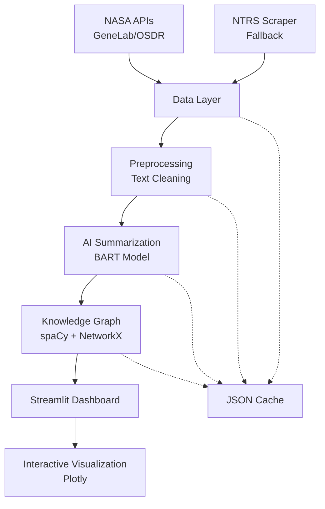

# NASA Space Biology Knowledge Graph
*AI-powered analysis and visualization of NASA research data for space biology insights*

## 🚀 Quick Start

### Setup
```bash
# Install dependencies
pip install -r requirements.txt

# Download spaCy language model
python -m spacy download en_core_web_sm

# Run the application
streamlit run app.py
```

### Access
- **Local**: http://localhost:8501
- **Demo**: [Streamlit Cloud Deployment](https://your-app.streamlit.app)

## 🏗️ Architecture Overview



### Data Flow
1. **Data Layer**: Fetch from GeneLab/OSDR APIs → Parse to DataFrame (100-300 items)
2. **Preprocessing**: Clean abstracts → Extract keywords → Handle missing data
3. **AI Summarization**: BART model → Generate impact summaries → Fallback rules
4. **Knowledge Graph**: spaCy NER → Extract entities → Build NetworkX graph
5. **Dashboard**: Interactive search → Filter results → Export capabilities

## 🧠 Key Features

### AI-Powered Analysis
- **BART Model**: Summarizes research abstracts focusing on space biology impacts
- **Smart Extraction**: Identifies microgravity effects, radiation impacts, organism responses
- **Fallback Processing**: Rule-based summarization when AI models are slow

### Knowledge Graph
- **Entities**: Experiments, Impacts, Results, Organisms, Locations
- **Relations**: `causes`, `affects`, `studied_in`, `results_in`
- **Query Engine**: Keyword search, subgraph extraction, relationship discovery

### Interactive Dashboard
- **Search & Filter**: Multi-parameter filtering by keywords, organism, experiment type
- **Visualization**: Clickable network graphs with Plotly integration
- **Export**: Download results as CSV, graph data as JSON
- **Caching**: Streamlit cache optimization for fast repeated queries

## 🛠️ Technical Stack

| Component | Technology | Purpose |
|-----------|------------|---------|
| **Frontend** | Streamlit 1.38.0 | Interactive web dashboard |
| **Data Processing** | Pandas 2.2.2 | DataFrame operations & analysis |
| **AI/NLP** | Transformers 4.44.2 + PyTorch | BART summarization model |
| **Knowledge Graph** | spaCy 3.7.6 + NetworkX 3.3 | Entity extraction & graph building |
| **Visualization** | Plotly 5.24.0 | Interactive network graphs |
| **Data Sources** | NASA GeneLab, OSDR, NTRS | Space biology research data |

## 📊 Challenge Alignment

### NASA Space Biology Requirements
- ✅ **AI Summarization**: BART-powered abstract summarization
- ✅ **Knowledge Graphs**: NetworkX-based relationship mapping
- ✅ **Interactive Dashboard**: Streamlit multi-page application
- ✅ **Data Integration**: Multiple NASA data sources
- ✅ **Impact Analysis**: Focus on space biology effects and outcomes

### Innovation Highlights
- **Hybrid AI**: Transformer models with rule-based fallbacks
- **Multi-source Integration**: APIs + web scraping for comprehensive data
- **Real-time Caching**: Optimized for hackathon demo performance
- **Scalable Architecture**: Modular design for easy extension

## 🚀 Deployment

### Streamlit Cloud
```bash
# Push to GitHub
git add .
git commit -m "NASA Space Biology Knowledge Graph"
git push origin main

# Deploy via Streamlit Sharing
# 1. Connect GitHub repo at share.streamlit.io
# 2. Select main branch and app.py
# 3. Advanced settings: Python 3.9+
# 4. Deploy automatically
```

### Local Development
```bash
# Development mode with hot reload
streamlit run app.py --server.runOnSave true

# Run tests
python -m pytest tests/

# Validate utils
python utils.py
```

## 🧪 Testing & Validation

- **Unit Tests**: Pytest for data processing functions
- **Integration Tests**: End-to-end pipeline validation
- **Cache Validation**: Reliability tests for repeated runs
- **Sample Data**: Offline testing with mock NASA data

## 👥 Team & Timeline

**Hackathon Prototype** - Built for NASA Space Biology Challenge  
**Timeline**: 48-hour development sprint  
**Focus**: MVP demonstrating AI + Knowledge Graph integration

---
*Built with ❤️ for advancing space biology research through AI-powered data analysis*